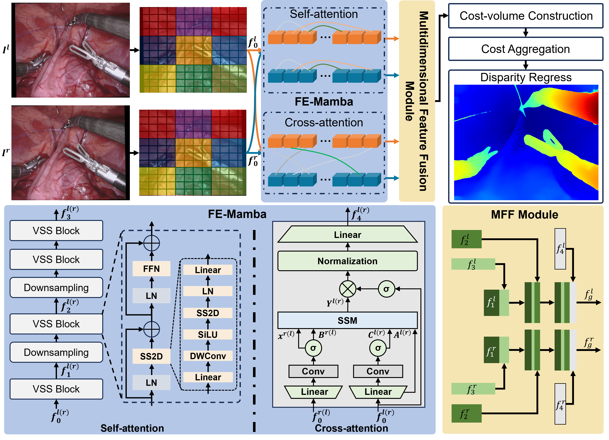

# StereoMamba: Real-time and Robust Intraoperative Stereo Disparity Estimation via Long-range Spatial Dependencies

[](https://www.python.org/downloads/)
[](https://pytorch.org/)

## Overview

### Architecture
This work has been accepted in IEEE RAL
Paper link: https://arxiv.org/abs/2402.18737



## Requirements

- Python 3.8+
- PyTorch 2.0+
- CUDA compatible GPU
- VMamba package
- Mamba package

## Setup

1. Create and activate conda environment:
```bash
conda create -n stereomamba python=3.8
conda activate stereomamba
```

2. Clone and install dependencies:
```bash
git clone https://github.com/MichaelWangGo/StereoMamba.git
cd StereoMamba
pip install -r requirements.txt

# Install VMamba
git clone https://github.com/MzeroMiko/VMamba.git
pip install -r requirements.txt
cd kernels/selective_scan && pip install .

# Install Mamba2
git clone https://github.com/state-spaces/mamba.git
pip install .
```

## Training Pipeline

### 1. Pretraining on Sceneflow
1. Download the Sceneflow dataset
2. Generate filename paths to .txt file (see `./datasets/filenames/`)
3. Configure dataset paths in `./training_configs/pretrain/config_sceneflow.json`:
   - Set `data_path`
   - Update `trainlist` and `testlist`
4. Start training:
```bash
python -m training_scripts.train_disparity \
    --default_config ./training_configs/pretrain/config_sceneflow.json \
    --cuda_id 0
```

### 2. Finetuning on SCARED
1. Prepare the SCARED dataset using the [Unofficial SCARED toolkit](https://github.com/dimitrisPs/scared_toolkit)
2. Configure dataset paths in `./training_configs/fine_tune/config_scared.json`
3. Start finetuning:
```bash
python -m training_scripts.train_disparity \
    --default_config ./training_configs/fine_tune/config_scared.json \
    --cuda_id 0
```

## Evaluation

### Generate Disparity Maps
```bash
python -m evaluation_scripts.save_disp \
    --restore_ckpt <path/to/model> \
    --default_config <path/to/config_file> \
    --output_directory <output_path> \
    --images_filename <path/to/image_list.txt>
```

### Evaluate on SCARED Dataset
```bash
python -m evaluation_scripts.evaluate_scared \
    --predictions <path/to/predictions> \
    --ground_truth <path/to/ground_truth> \
    --csv <output_results.csv>
```

### Evaluate on RIS/StereoMIS
1. Modify the following paths in the script:
   - `left_img_path`
   - `right_img_path`
   - `disp_path`
2. Run evaluation:
```bash
python -m evaluation_scripts.reprojection_error
```

## Additional Resources

For dataset preparation and tools:
- [Unofficial SCARED toolkit](https://github.com/dimitrisPs/scared_toolkit) - For generating disparity samples and stereo rectification


